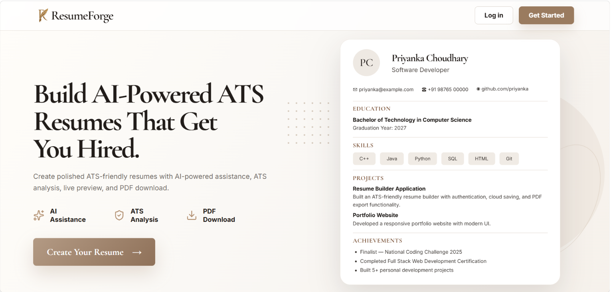
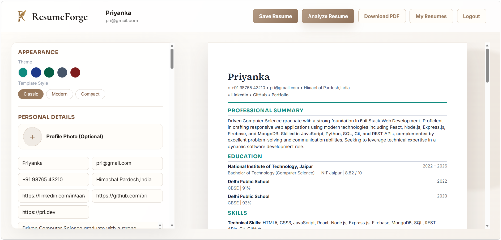
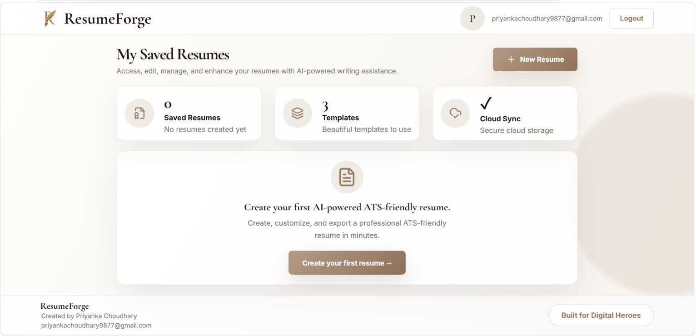
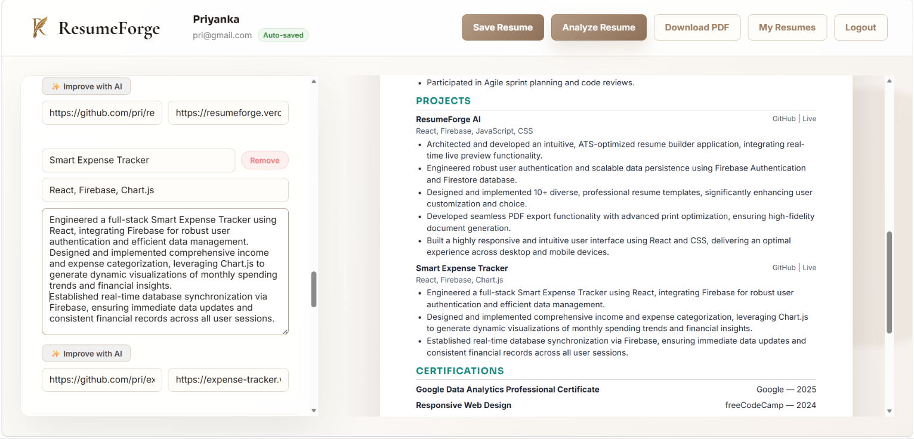
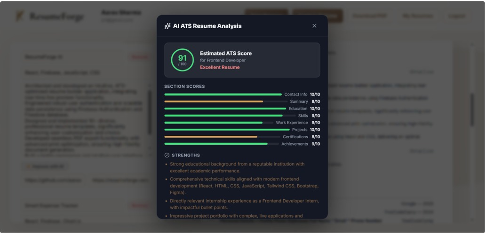
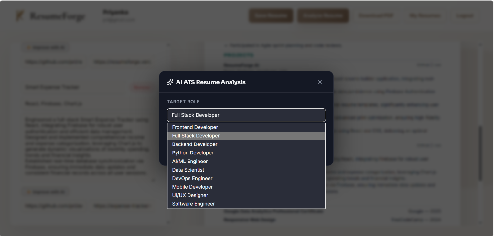
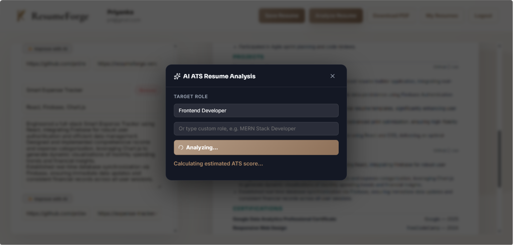
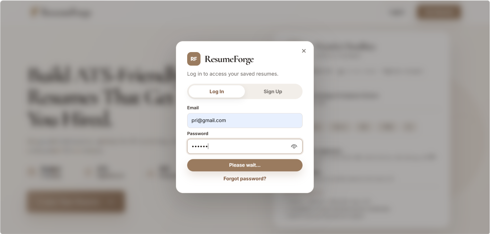
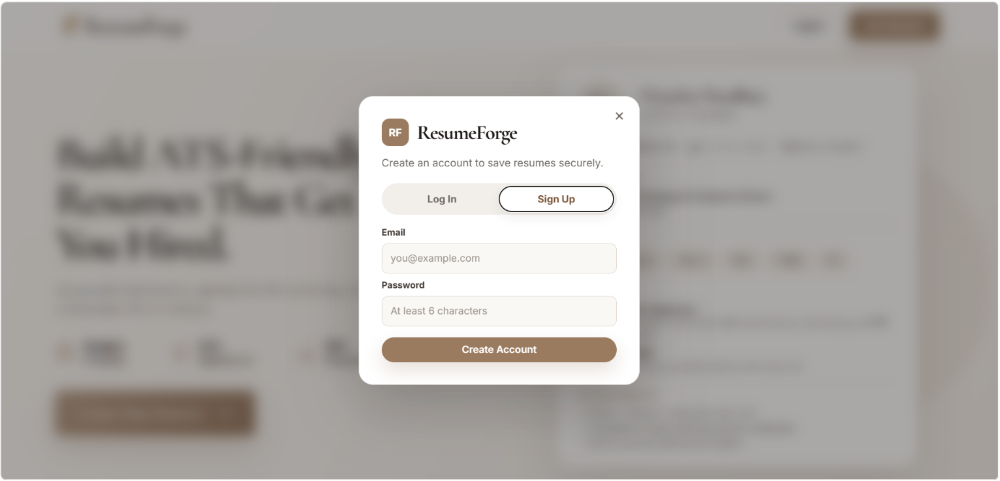

<div align="center">

<br />



<br />
<br />

# ResumeForge

**Build ATS-ready resumes in minutes — powered by Google Gemini AI**

<p>
  <a href="https://resumeforge-ai-rho.vercel.app">
    
  </a>
  &nbsp;
  <a href="https://github.com/PriyankaChoudhary9877/ResumeForge-AI">
    
  </a>
</p>

<p>
  
  
  
  
  
  
</p>

</div>

---

## Overview

ResumeForge is a modern resume builder that helps students and professionals create ATS-friendly resumes with AI-powered writing assistance. It combines resume editing, ATS analysis, cloud storage, and PDF export into one simple application.

---

## Screenshots

<table>
  <tr>
    <td align="center" width="50%">
      <b>Resume Builder</b><br /><br />
      
    </td>
    <td align="center" width="50%">
      <b>Resume Dashboard</b><br /><br />
      
    </td>
  </tr>
  <tr>
    <td align="center" width="50%">
      <b>AI Resume Improvement</b><br /><br />
      
    </td>
    <td align="center" width="50%">
      <b>ATS Analysis Result</b><br /><br />
      
    </td>
  </tr>
</table>

<details>
<summary><b>More Screenshots</b></summary>

<br />

**ATS Analysis — Target Role Selection**

<p align="center">
  
</p>

**ATS Analysis — Processing**

<p align="center">
  
</p>

**Authentication**

<table align="center">
  <tr>
    <td align="center"><b>Login</b><br /><br /></td>
    <td align="center"><b>Register</b><br /><br /></td>
  </tr>
</table>

</details>

---

## Features

| Feature | Description |
|---|---|
| AI ATS Analysis | Score your resume for ATS compatibility with per-section feedback |
| AI Summary Generator | Generate a professional summary based on your resume content |
| AI Resume Improvement | Improve bullet points in your experience and project sections |
| Missing Keyword Detection | Identify keywords missing for a specific target role |
| Live Resume Preview | See changes reflected in real time as you edit |
| Multiple Templates | Choose from several resume layout options |
| Theme Customization | Adjust colors and styling to match your preference |
| Resume Dashboard | View, rename, duplicate, and delete saved resumes |
| Resume Completion Score | Track how complete your resume is |
| Firebase Authentication | Secure login, registration, and password reset |
| Cloud Sync | Save and access your resumes securely using Firestore. |
| PDF Export | Download an ATS-friendly PDF version of your resume |
| Responsive Design | Works on desktop and mobile |

---

## Tech Stack

<table>
  <tr>
    <td valign="top" width="25%">
      <b>Frontend</b><br /><br />
      <br />
      <br />
      <br />
      <br />
      
    </td>
    <td valign="top" width="25%">
      <b>Backend & Auth</b><br /><br />
      <br />
      
    </td>
    <td valign="top" width="25%">
      <b>AI</b><br /><br />
      
    </td>
    <td valign="top" width="25%">
      <b>Deployment</b><br /><br />
      
    </td>
  </tr>
</table>

---

## Getting Started

<details>
<summary><b>Prerequisites</b></summary>

<br />

- Node.js `v18+`
- A Firebase project with Authentication and Firestore enabled
- A Google Gemini API key

</details>

<details open>
<summary><b>Installation</b></summary>

<br />

**1. Clone the repository**

```bash
git clone https://github.com/PriyankaChoudhary9877/ResumeForge-AI.git
cd ResumeForge-AI
```

**2. Install dependencies**

```bash
npm install
```

**3. Configure environment variables**

Create a `.env` file in the root directory:

```env
VITE_FIREBASE_API_KEY=YOUR_FIREBASE_API_KEY
VITE_FIREBASE_AUTH_DOMAIN=YOUR_FIREBASE_AUTH_DOMAIN
VITE_FIREBASE_PROJECT_ID=YOUR_FIREBASE_PROJECT_ID
VITE_FIREBASE_STORAGE_BUCKET=YOUR_FIREBASE_STORAGE_BUCKET
VITE_FIREBASE_MESSAGING_SENDER_ID=YOUR_MESSAGING_SENDER_ID
VITE_FIREBASE_APP_ID=YOUR_FIREBASE_APP_ID
VITE_GEMINI_API_KEY=YOUR_GEMINI_API_KEY
```

**4. Start the development server**

```bash
npm run dev
```

</details>

<details>
<summary><b>Build for Production</b></summary>

<br />

```bash
npm run build
npm run preview
```

</details>

---

## Project Structure

```
ResumeForge-AI/
│
├── public/                    # Static assets & screenshots
│
├── src/
│   ├── components/            # UI components
│   ├── context/               # React context providers
│   ├── lib/                   # Firebase and API setup
│   ├── utils/                 # Helper functions
│   ├── App.jsx
│   ├── App.css
│   └── main.jsx
│
├── package.json
├── vite.config.js
└── README.md
```

---

## Future Improvements

Features I plan to add:

- Cover Letter Generator
- Resume Import
- More Resume Templates
- Dark Mode

---

## Author

<table>
  <tr>
    <td align="center">
      <b>Priyanka Choudhary</b><br />
      Computer Science Engineering Student<br /><br />
      <a href="https://github.com/PriyankaChoudhary9877">
        
      </a>
      &nbsp;
      <a href="https://www.linkedin.com/in/priyanka-choudhary-58b048312/">
        
      </a>
      &nbsp;
      <a href="https://resumeforge-ai-rho.vercel.app">
        
      </a>
      &nbsp;
      <a href="mailto:priyankachoudhary9877@gmail.com">
        
      </a>
    </td>
  </tr>
</table>

---

<div align="center">

If you found this project helpful, consider giving it a ⭐ on GitHub.

<br />

Designed and developed by Priyanka Choudhary.

</div>
